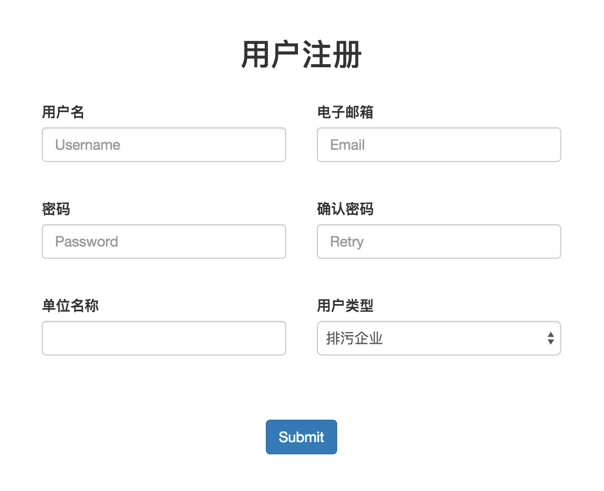
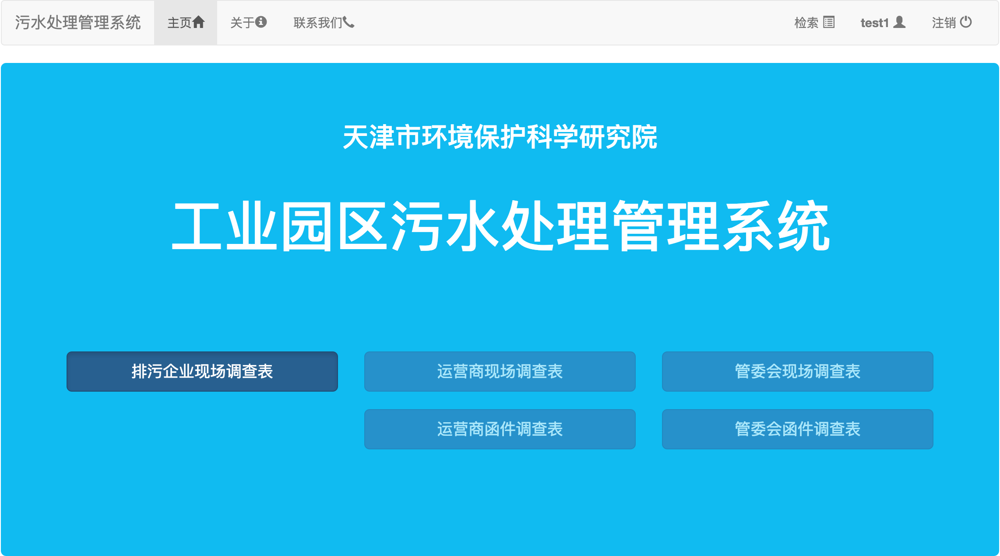
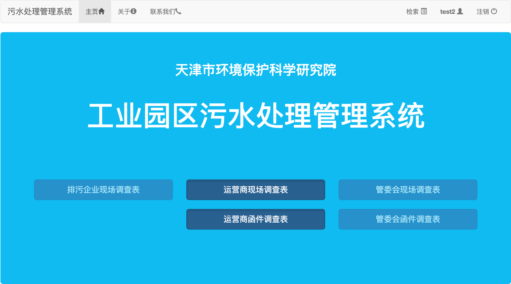
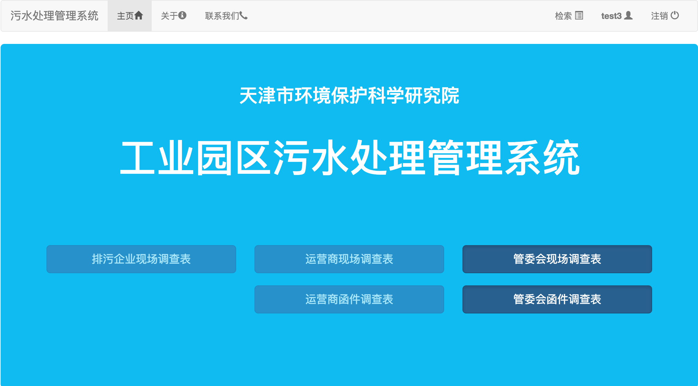
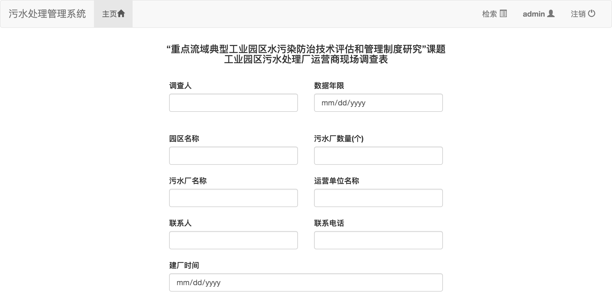
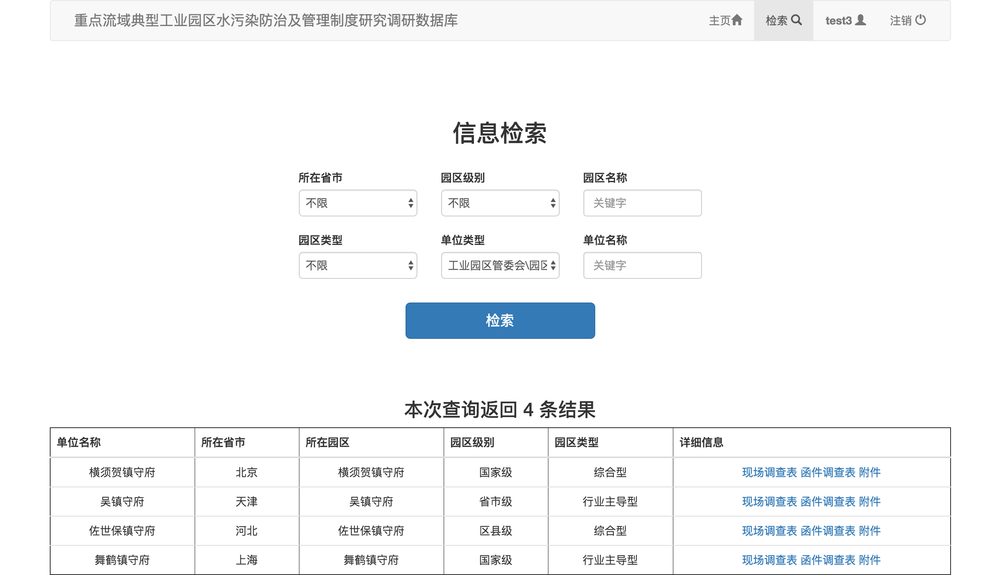
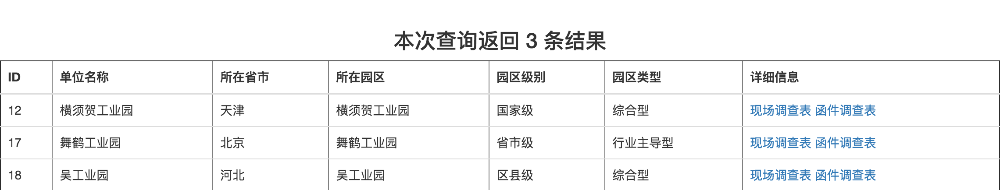
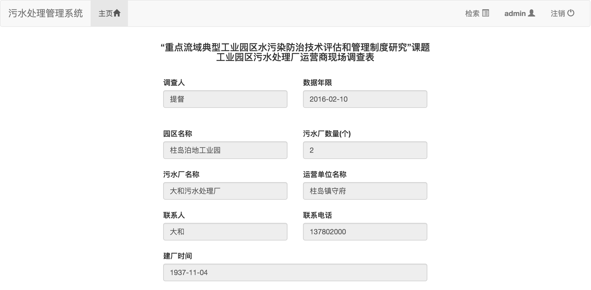

#问卷调查系统
##概述
**工业园区污水处理管理系统**是一个使用PHP开发的Web问卷调查系统，将其搭建在服务器端可以实现使受访者通过互联网提交问卷并在后台进行结果统计汇总的功能，极大地减少了人工录入数据的工作量。

##结构
###程序结构
本系统主要由以下页面构成：

+ 主页面 home.php
+ 登录界面 signin.php
+ 注册界面 signup.php
+ 问卷填写（5张问卷） q\_\*.php && i\_\*.php
+ 关键字检索页面 search.php
+ 问卷结果显示（5张问卷） q\_\*\_r.php && i\_\*\_r.php

###数据结构
后台数据库由以下表构成：

+ user_info
+ CompanyQuestionnaire
+ SewageTreatmentQuestionnaire
+ IndustrialParkQuestionnaire
+ SewageTreatmentInvestigation
+ IndustrialParkInvestigation

##过程
首先通过[index.php](index.php)索引页面跳转到主页，在未登录的状态下会显示**登录**和**注册**按钮


可以通过**注册**按钮跳转到注册界面[signup.php](signup.php)



登录后的主页[home.php](home.php)会显示各问卷的入口链接，并且右上角显示当前的**用户名**和**注销**按钮


各问卷的跳转链接会根据登录用户的类型设置为*激活*或*禁用*状态，这样可以保证用户仅能访问其有权限访问的问卷







进入每份问卷后可以对其进行编辑提交和文件上传。每个字段对其可填写的内容进行了限制（如必须填写数字的地方不能填写其他字符，必填项目不能留空等）



当用户类型为管理员时，其有权限看到所有问卷，而且管理员有权限进入问卷检索界面[search.php](search.php)



在选择问卷类型并填写关键字后，会对数据库中单位的名称进行与关键字匹配并返回符合条件的结果数目和具体信息



查看详细信息后会跳转到问卷结果页面



##环境
###开发环境

+ OS X 10.11.3
+ Nginx 1.8.1
+ MySQL 5.6.27
+ PHP 5.6.18
+ PhpStorm 10.0.3

###运行环境
若要正常运行本系统，首先确保服务器端至少已经安装以下环境：

+ Nginx（或Apache）服务器
+ MySQL 5.6+ 数据库
+ PHP 5.6+

##安装
###Windows
####配置PHP
首先前往[PHP For Windows](http://windows.php.net/download#php-5.6)下载对应版本的`PHP 5.6`。

解压并安装，之后将PHP的`/bin`目录添加到环境变量中。在安装目录下新建`php.ini`文件并将`php.ini-development`的内容复制到里面，将`extension_dir`的值改为`ext`文件夹的绝对路径，再将`cgi.force_redirect=1`、`extension=php_mysql.dll`和`extension=php_mysqli.dll`解注释，并将`cgi.force_redirect`的参数改为`0`。

####配置MySQL
首先前往[MySQL Installer](http://dev.mysql.com/downloads/windows/installer/5.7.html)下载对应版本的`MySQL 5.7`。

安装并设置root密码，将MySQL Server的`/bin`目录添加到环境变量中。

打开命令提示符，输入`mysql -u root -p`命令并输入root密码进入MySQL。创建新数据库`GYYQ_database`：

	CREATE DATABASE GYYQ_database;	
	
之后将本项目`db`目录下的`.sql`文件导入到新建的数据库中：

	USE GYYQ_database;
	SOURCE GYYQ_database_2016-02-28.sql;
	
编辑工程中的`connectdb.php`文件：

```
$con=mysqli_connect("localhost","root","password","GYYQ_database");
```

将`password`改为root密码即可。

####配置Nginx
首先前往[nginx: download](http://nginx.org/en/download.html)下载`Nginx 1.8`。

解压并安装。启动`nginx.exe`并从浏览器打开[localhost](http://localhost:80/)，如果出现Nginx的欢迎接界面则说明安装正确。

编辑`nginx.conf`文件：

```
location / {  
    root   your_path;  
    index  index.html index.htm index.php;  
}  
```

将`root`改为工程所在的路径，并在`index`中加入`index.php`

```
location ~ \.php$ {  
    root           your_path;  
    fastcgi_pass   127.0.0.1:9000;  
    fastcgi_index  index.php;  
    fastcgi_param  SCRIPT_FILENAME  $document_root$fastcgi_script_name;  
    include        fastcgi_params;  
}  
```

将php的一段解注释并将`root`改为工程所在的路径，将`fastcgi_param`改为如上所示。

这时再次打开[localhost](http://localhost:80/)，如出现登录界面则配置完成。

###Linux
####配置PHP
CentOS安装命令：
	
	sudo yum install php-fpm php-mysql
	
Ubuntu安装命令：

	sudo apt-get install php5-fpm php5-mysql
	
编辑`php.ini`文件，修改参数：

	cgi.fix_pathinfo=0
	
####配置MySQL
CentOS安装命令：

	sudo yum install mysql-server
	
Ubuntu安装命令：

	sudo apt-get install mysql-server
	
重启MySQL服务：
	
	sudo /etc/init.d/mysqld restart
	
配置root密码：

	sudo /usr/bin/mysql_secure_installation
	
第一次要求输密码时因为尚未配置因此直接回车即可，然后按照提示进行设置即可。

配置完成后使用`mysql -u root -p`命令并输入root密码进入MySQL。建立新数据库`GYYQ_database`：

	CREATE DATABASE GYYQ_database;	
	
之后将`db`目录下的`.sql`文件导入到新建的数据库中：

	USE GYYQ_database;
	SOURCE GYYQ_database_2016-02-28.sql;
	
编辑工程中的`connectdb.php`文件：

```
$con=mysqli_connect("localhost","root","password","GYYQ_database");
```

将`password`改为root密码即可。
	
####配置Nginx
CentOS安装命令：

	sudo yum install nginx
	
Ubuntu安装命令：

	sudo apt-get install nginx
	
启动Nginx服务器：

	sudo /etc/init.d/nginx start
	
编辑`default.conf`文件：

```
location / {  
    root   your_path;  
    index  index.html index.htm index.php;  
}  
```

将`root`改为工程所在的路径，并在`index`中加入`index.php`

```
location ~ \.php$ {  
    root           your_path;  
    fastcgi_pass   127.0.0.1:9000;  
    fastcgi_index  index.php;  
    fastcgi_param  SCRIPT_FILENAME  $document_root$fastcgi_script_name;  
    include        fastcgi_params;  
}  
```

将php的一段解注释并将`root`改为工程所在的路径，将`fastcgi_param`改为如上所示。

这时打开[localhost](http://localhost:80/)，如出现登录界面则配置完成。

##开始使用
可以使用默认的管理员账户登录取得最高的访问权限：

+ 用户名：`admin`
+ 密码：`password` (由于初始密码较弱，请到数据库中修改）

如果一切正常则部署完成。