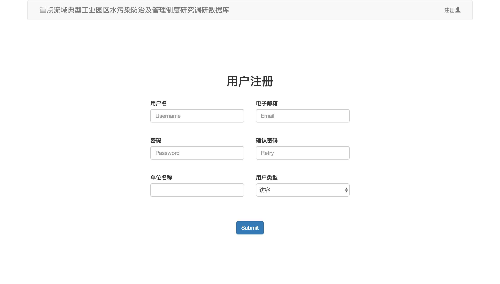

#某调研数据库
##项目概述
**XXXX调研数据库**是一个使用PHP开发的Web数据管理系统，用户可以使用本系统进行指定数据的录入、修改、查询、导出等功能，极大地减少了人工录入统计的工作量。

##程序结构
###文件结构
```
.
├── connectdb.php 数据库连接
├── db 数据库文件
│   ├── gyyq_database_2016-03-22.sql
│   └── query.cpp
├── export.php 数据导出
├── feedback 调查表显示
│   ├── i_IndustrialPark.php
│   ├── i_SewageTreatment.php
│   ├── q_Company.php
│   ├── q_IndustrialPark.php
│   └── q_SewageTreatment.php
├── files 附件上传位置
│   ├── 处理厂现场调查表附件
│   ├── 管委会现场调查表附件
│   └── 排污企业现场调查表附件
├── home.php 主页面
├── index.php 索引
├── questionnaire 调查表
│   ├── i_IndustrialPark.php
│   ├── i_SewageTreatment.php
│   ├── q_Company.php
│   ├── q_IndustrialPark.php
│   └── q_SewageTreatment.php
├── search.php 检索页面
├── signout.php 注销
├── signup.php 注册页面
├── statistics 数据统计
│   ├── Company.php
│   ├── IndustrialPark.php
│   └── SewageTreatment.php
└── user.php 用户信息
```

###数据结构
+ user_info 用户信息表
+ CompanyQuestionnaire 企业现场调查表
+ SewageTreatmentQuestionnaire 处理厂现场调查表
+ IndustrialParkQuestionnaire 园区现场调查表
+ SewageTreatmentInvestigation 处理厂函件调查表
+ IndustrialParkInvestigation 园区函件调查表

##主要功能
首先通过[index.php](index.php)索引页面跳转到主页，在未登录的状态下会显示**登录**和**注册**按钮


可以通过**注册**按钮跳转到注册界面[signup.php](signup.php)



注册成功后返回主页面登录，主页[home.php](home.php)会显示各问卷的填写链接和数据统计链接，并且右上角显示当前的**用户名**和**注销**按钮


点击**注销**按钮后会注销当前登录状态；点击用户名会打开用户信息


各问卷的跳转链接会根据用户权限设置为*激活*或*禁用*状态，这样可以保证用户仅能访问其有权限访问的问卷


进入每份问卷后可以对其进行编辑提交和文件上传。每个字段对其可填写的内容进行了限制（如必须填写数字的地方不能填写其他字符，必填项目不能留空等）


也可以通过右上角的**搜索**按钮搜索已经提交过的问卷，按条件筛选


可以通过每张问卷后面的详细信息查看问卷内容或附件，如果有相应的权限也可以编辑或删除该问卷


从主界面进入数据统计界面可以按照指定的关键字和字段查询数据并排序，也可以用**导出**按钮导出下载


##环境
###开发环境

+ OS X 10.11.3
+ Nginx 1.8.1
+ MySQL 5.6.27
+ PHP 5.6.18
+ PhpStorm 10.0.3

###运行环境
若要正常运行本系统，首先确保本机或服务器端至少已经安装以下环境：

+ Nginx（或Apache）服务器
+ MySQL 5.6+ 数据库
+ PHP 5.6+

##安装
###Windows
首先需要WNMP或WAMP环境，请下载[phpStudy](http://www.phpstudy.net/phpstudy/phpStudy.zip)

下载并安装后，进入到安装目录下，将本项目完整复制到WWW文件夹中


之后运行`phpstudy.exe`启动程序，并修改MySQL的root密码


原始密码是`root`，新密码需要与工程中`connectdb`中设置的密码相同（这里默认是`password`，建议将二者改为更强的密码）


修改完成后点击`启动`按钮，如果服务器和数据库的状态变绿则说明启动成功


这时需要导入数据库，选择`MySQL导入导出`


在`还原`中选择工程中`db`目录下的`sql`文件


数据库名称为`GYYQ_database`，不要忘记输入刚才设置的数据库密码，导入就可以了


这时打开浏览器（建议不要使用IE浏览器）键入地址(localhost/survey/index.php)[localhost/survey/index.php]就可以了。


###Linux
####配置PHP
CentOS安装命令：
	
	sudo yum install php-fpm php-mysql
	
Ubuntu安装命令：

	sudo apt-get install php5-fpm php5-mysql
	
编辑`php.ini`文件，修改参数：

	cgi.fix_pathinfo=0
	
####配置MySQL
CentOS安装命令：

	sudo yum install mysql-server
	
Ubuntu安装命令：

	sudo apt-get install mysql-server
	
重启MySQL服务：
	
	sudo /etc/init.d/mysqld restart
	
配置root密码：

	sudo /usr/bin/mysql_secure_installation
	
第一次要求输密码时因为尚未配置因此直接回车即可，然后按照提示进行设置即可。

配置完成后使用`mysql -u root -p`命令并输入root密码进入MySQL。建立新数据库`GYYQ_database`：

	CREATE DATABASE GYYQ_database;	
	
之后将`db`目录下的`.sql`文件导入到新建的数据库中：

	USE GYYQ_database;
	SOURCE GYYQ_database_2016-02-28.sql;
	
编辑工程中的`connectdb.php`文件：

```
$con=mysqli_connect("localhost","root","password","GYYQ_database");
```

将`password`改为root密码即可。
	
####配置Nginx
CentOS安装命令：

	sudo yum install nginx
	
Ubuntu安装命令：

	sudo apt-get install nginx
	
启动Nginx服务器：

	sudo /etc/init.d/nginx start
	
编辑`default.conf`文件：

```
location / {  
    root   your_path;  
    index  index.html index.htm index.php;  
}  
```

将`root`改为工程所在的路径，并在`index`中加入`index.php`

```
location ~ \.php$ {  
    root           your_path;  
    fastcgi_pass   127.0.0.1:9000;  
    fastcgi_index  index.php;  
    fastcgi_param  SCRIPT_FILENAME  $document_root$fastcgi_script_name;  
    include        fastcgi_params;  
}  
```

将php的一段解注释并将`root`改为工程所在的路径，将`fastcgi_param`改为如上所示。

这时打开[localhost](http://localhost:80/)，如出现登录界面则配置完成。

##开始使用
可以使用默认的管理员账户登录取得最高的访问权限：

+ 用户名：`admin`
+ 密码：`password` (由于初始密码较弱，请到数据库中修改）

如果一切正常则部署完成。