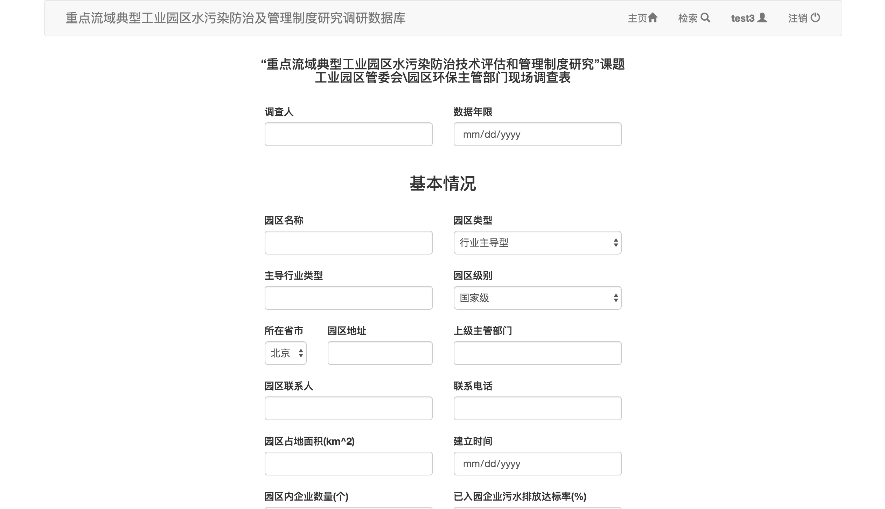

#问卷调查系统
##概述
**工业园区污水处理管理系统**是一个使用PHP开发的Web问卷调查系统，将其搭建在服务器端可以实现使受访者通过互联网提交问卷并在后台进行结果统计汇总的功能，极大地减少了人工录入数据的工作量。

##结构
###程序结构
本系统主要由以下页面构成：

+ 主页面 home.php
+ 登录界面 signin.php
+ 注册界面 signup.php
+ 问卷填写（5张问卷） q\_\*.php && i\_\*.php
+ 关键字检索页面 search.php
+ 问卷结果显示（5张问卷） q\_\*\_r.php && i\_\*\_r.php

###数据结构
后台数据库由以下表构成：

+ user_info
+ CompanyQuestionnaire
+ SewageTreatmentQuestionnaire
+ IndustrialParkQuestionnaire
+ SewageTreatmentInvestigation
+ IndustrialParkInvestigation

##过程
首先通过`index.php`索引页面跳转：如果未登录则会自动跳转到系统登录界面，若此时直接进入主页，同样会显示登录按钮

在登录界面`signin.php`设有**登录**和**注册**按钮

可以通过**注册**按钮跳转到注册界面`signup.php`

如果已经登录则跳转到主页面`home.php`，并且显示各问卷的入口链接，并且右上角显示当前的用户名和**注销**按钮

各问卷的跳转链接会根据登录用户的类型设置为*激活*或*禁用*状态，这样可以保证用户仅能访问其有权限访问的问卷

进入每份问卷后可以对其进行编辑提交和文件上传。每个字段对其可填写的内容进行了限制（如必须填写数字的地方不能填写其他字符，必填项目不能留空等）

当用户类型为管理员时，其有权限看到所有问卷，而且管理员有权限进入问卷检索界面`search.php`

在选择问卷类型并填写关键字后，会对数据库中单位的名称进行与关键字匹配并返回查询的结果表格

查看详细信息后会跳转到问卷结果页面

##环境
###开发环境
+ OS X 10.11.3
+ Nginx 1.8.1
+ MySQL 5.6.27
+ PHP 5.6.18
+ PhpStorm 10.0.3

###运行环境
若要正常运行本系统，首先确保服务器端至少已经安装以下环境：

+ Linux发行版
+ Nginx（或Apache）服务器
+ MySQL 5.6+ 数据库
+ PHP 5.6+

##安装
###配置PHP
编辑`/etc/php.ini`文件，修改参数：

	cgi.fix_pathinfo=0
	
###配置MySQL
在MySQL数据库中建立新数据库`GYYQ_database`：

	CREATE DATABASE GYYQ_database;	
	
之后将`db`目录下的`.sql`文件导入到新建的数据库中：

	USE GYYQ_database;
	SOURCE GYYQ_database_2016-02-27.sql;
	
###配置Nginx
编辑`/etc/nginx/conf.d/default.conf`文件，去掉这段注释：

	location ~ \.php$ {
        root           /usr/share/nginx/html;
        fastcgi_pass   127.0.0.1:9000;
        fastcgi_index  index.php;
        fastcgi_param  SCRIPT_FILENAME   $document_root$fastcgi_script_name;
        include        fastcgi_params;
    }

然后在

	location / {
        root   /usr/share/nginx/html;
        index index.php  index.html index.htm;
    }
    
的`index`中加入`index.php`

之后将本项目上传到服务器端html目录下，然后修改`connectdb.php`：

	$con=mysqli_connect("localhost","root","password","GYYQ_database");
	
将`password`改为MySQL的root密码。

这时可以通过浏览器打开`index.php`，如果正常打开说明服务器设置正确。

再打开`connectdb.php`，如果没有出现错误则说明数据库连接成功。

于是可以使用管理员账户登录测试功能

+ 用户名：`admin`
+ 密码：`password` (由于初始密码较弱，请到数据库中修改）

如果一切正常则部署完成。